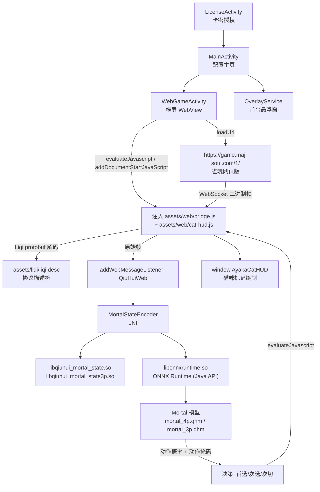

# 雀魂麻将 · majsoul

> 一个面向 **「雀魂」(Mahjong Soul) 网页版** 的第三方 Android 辅助客户端。
> 形态上是「WebView 壳 + 本地 AI 推理」：把雀魂官网塞进 WebView，注入脚本拦截对局协议帧，本地跑 **Mortal** 神经网络模型算出打牌建议，再用悬浮窗/HUD 把「切哪张牌」画在牌桌上。
>
> **非官方、非授权工具。本仓库仅用于逆向分析与技术学习交流。**

---

## ⚠️ 免责声明

- 本项目与 **猫粮工作室 / Yostar / 雀魂 (Mahjong Soul)** 官方**没有任何关系**，不是官方客户端。
- 雀魂官方明令禁止使用第三方辅助/自动化工具。使用本类工具**可能导致账号被永久封禁**，风险完全由使用者自行承担。
- 仓库内容为对既有 APK 的**反编译结果与静态分析记录**，仅供安全研究、逆向工程学习使用，**不提供任何形式的担保**。
- 请勿将本项目用于商业用途或任何破坏游戏公平性的场景。若你是权利方并认为内容不当，请联系删除。

---

## 一、项目概览

| 项目 | 值 |
|---|---|
| 应用名 | 雀魂麻将 |
| 包名 | `com.majsoul` |
| 代码内应用 ID | `com.qiuhui.mahjong`（`appId: qiuhui-mahjong-android`） |
| versionCode | `102` |
| versionName | `9.9.9`（明显为占位/伪装版本号） |
| minSdkVersion | `26`（Android 8.0） |
| targetSdkVersion | `35`（Android 15） |
| compileSdkVersion | `35` |
| APK 体积 | 202,382,727 字节（约 193 MiB） |
| 签名 | v1（`META-INF/ANDROID.RSA`）+ v2/v3（存在 `APK Sig Block 42`） |
| 启动入口 | `com.qiuhui.mahjong.LicenseActivity`（MAIN/LAUNCHER） |
| 目标站点 | `https://game.maj-soul.com/1/` |
| 授权服务 | `https://qiuhui-license-*.cn-hangzhou.fcapp.run`（阿里云函数计算） |

启动链路：`LicenseActivity`（授权页）→ `MainActivity`（配置主页）→ `WebGameActivity`（横屏 WebView 游戏容器）+ `OverlayService`（前台悬浮窗服务）。

---

## 二、功能分析

### 1. 小猫推荐（切牌推荐 HUD）—— 核心功能

开启后会在牌桌上直接叠加「该切哪张牌」的提示标记。

- 绘制实现见 [`assets/web/cat-hud.js`](assets/web/cat-hud.js)，对外暴露 `window.AyakaCatHUD`。
- 每张推荐牌上方浮出一个 **猫咪造型的 SVG 标签**（纯 DOM/CSS 绘制，无位图资源），标签内显示动作文字（`切` / `立直` / `吃` / `碰` / `碰` 等）+ 置信度数字。
- 通过 `Laya` 引擎的实时节点定位：读取 `view.DesktopMgr.Inst.players[0].hand`，用 `localToGlobal()` 把牌面坐标换算到 canvas 坐标，因此标记能精确压在牌上而不依赖固定像素。
- 处理了三类「布局还在动」的边界情况：
  - 庄家开局第 14 张牌仍在做入场动画 → `followDealerOpening` 以 30Hz 跟随 900ms；
  - 吃/碰/杠后手牌重排 → `followHandLayout` 跟随 1.1s（暗杠加杠延长到 2.2s）；
  - 立体牌在 Laya 数组中的顺序与协议排序不一致 → 按「牌值 + 右侧优先」而不是按下标定位。
- 支持 16:9 逻辑舞台裁剪（`activeGameRect`）：全面屏手机上把 HUD 锚点限制在居中的 16:9 游戏区内，不跟着超宽装饰背景跑偏。
- 三套配色（金色主选、蓝色次选），主选会额外做发光/缩放动画。

### 2. 自动打牌（Automation）

`自动打牌配置` 面板，配合 `assets/web/bridge.js` 中的 `__qiuhuiAutoPlay`：

- `instant_discard_enabled`：是否秒切（不等动画）。
- `discard_delay_min_ms` / 切牌延迟区间：`切牌延迟 %.1f–%.1f 秒`，随机化出牌间隔，避免机械化的固定节奏。
- `moqie`（摸切）、`timeuse`（思考耗时）、`optionIndex`（选项下标）、`verificationDelayMs`：用于替代人类点击的「拟人化」参数。
- 通过 `__qiuhuiSetActiveDecision` / `__qiuhuiOpeningDiscardReady` / `__qiuhuiCanFallbackDecision` 等注入函数，与页面内的决策状态机握手，确保只在「当前确实轮到自己」时才出手。

### 3. 悬浮窗（OverlayService）

- 前台服务，`foregroundServiceType` 声明为 `PROPERTY_SPECIAL_USE_FGS_SUBTYPE = "User-controlled Mahjong recommendation overlay"`，即「用户自行控制的麻将推荐浮层」——这是 Android 14+ 对特殊用途前台服务的合规声明方式。
- 服务通知里直接提供开关与状态：`等待登录` / `等待对局` / `对局中` / `切牌推荐`。
- 支持 `横向显示` / `竖向显示` / `vertical_compact` 三种紧凑布局。
- 交互约定：**长按关闭悬浮窗**（`请长按以关闭悬浮窗`）。
- 文案明确：`开启/关闭悬浮窗不影响小猫推荐`——即 HUD 推荐与悬浮窗是两条独立通路。

### 4. 全皮肤解锁

- 资源内自带 [`assets/majsoulmax/max_data.yaml`](assets/majsoulmax/max_data.yaml)，内容为角色 ID 白名单（`200001` 起连续枚举）等解锁数据。
- 支持在线增量更新：`正在下载皮肤数据` → `正在校验完整性与兼容性` → `正在安全安装更新` → `更新完成 重启游戏后生效`，失败时 `更新失败 已保留原有可用版本`（回滚保护）。
- 相关注入函数：`__qiuhuiSkinUnlockReceive`、`__qiuhuiFullSkinEnabled`；在 `bridge.js` 中通过伪造/改写 `fullSkinFakeRequestIn`、`fullSkinResponseRequestIn` 来影响客户端对皮肤持有状态的判断。

### 5. 画质 / 帧率设置（BrowserDisplaySettings）

- 两档画质：`720P` / `1080P`，配合 `render_width` / `render_height` / `content_hz` 参数。
- 通过 `patchResolutionController` / `applyHighQualityResolution` / `startResolutionEnforcement` 强行维持 WebView 渲染分辨率，并在 `observeResolutionChanges` 中监控被游戏引擎改回去的情况。
- 内置性能警告原文：*「因为软件本身需要大量的计算，开启高画质可能会导致手机发烫，声音链路受阻，建议性能强大的手机选择！」*
- 还有 `__qiuhuiStrict4k`、`__qiuhuiWideViewport`、`__qiuhuiFullscreenAdapt` 等实验性显示开关。

### 6. WebView 组件版本检测

启动时读取 `WebViewUpdateService.getCurrentWebViewPackageName()`，若系统 WebView 过旧则直接阻断并提示：

> 系统网页组件版本过旧，AI 无法安全启动
> 1. 点击此处进入手机应用商店 2. 更新当前网页组件；若搜不到，请更新 Chrome 3. 更新后彻底关闭本软件，再重新打开

### 7. 音频保活

`bridge.js` 中 hook 了 `AudioContext` / `webkitAudioContext`，在 `pointerdown` / `touchstart` / `focus` / `pageshow` / `visibilitychange` 时自动 `resume()` 挂起的音频上下文——避免切到后台再回来时游戏静音。

### 8. 授权与续费

- 入口是 `LicenseActivity`，输入**十位卡密**（`请输入正确的十位卡密` / `输入十位卡密`）。
- 状态：`正在验证授权` → `激活` / `激活授权` / `授权失败` / `授权凭证缺失` / `需要刷新在线凭证` / `已授权（永久）` / `有效期至 …` / `续费授权` / `正在续费`。
- 校验要素（见 `q/i3.smali`）：`appId`、`licenseKey`、`token`、`plan`、`expiresAt`，以及 `deviceId` / `devicePublicKey` / `deviceFingerprint` / `deviceProof` / `requestNonce` / `requestTime`。
- 设备身份用 **AndroidKeyStore 中的 secp256r1 密钥**做 `SHA256withECDSA` 签名（别名 `qiuhui_device_identity_v1`），请求强制 HTTPS（`HTTPS_REQUIRED`）。
- 网络异常处理文案：`⚠当前网络无法连接更新服务器，您可以一段时间后重试，或者建议您"科学上网"后重试。`

---

## 三、技术架构



数据通路的关键点：**推理不在 WebView 里做**。`bridge.js` 只负责「截帧 + 轻量解析 + 展示」，真正的状态编码与神经网络推导都在 Native 侧（JNI + ONNX Runtime），结果再以 `evaluateJavascript` 回注到页面里画标记。这样规避了 WebView 内 JS 算力不足的问题，也顺带让核心模型更难被直接扒走（模型文件本身还做了加密）。

### Native 层接口（`com.qiuhui.mahjong.MortalStateEncoder`）

```java
static native long nativeCreate(int);        // 四麻编码器
static native long nativeCreate3p(int);      // 三麻编码器
static native void nativeDestroy(long);
static native void nativeDestroy3p(long);
static native float[] nativeUpdate(long, String);   // 传入协议 JSON → 输出观测张量
static native float[] nativeUpdate3p(long, String);
```

输入是协议的 JSON 序列化结果，输出是直接喂给 ONNX 的观测向量（`float[]`）。

### 模型规格（`assets/models/manifest.json`）

| 项目 | 四麻 | 三麻 |
|---|---|---|
| 文件 | `mortal_4p.qhm` | `mortal_3p.qhm` |
| 加密格式 | `QH-AES256-GCM-CHUNKED-2` | 同左 |
| 输入通道 | 1012 | 775 |
| 动作空间 | 46 | 44 |
| 大小 | 95,289,149 字节 | 91,315,077 字节 |

模型并非裸 ONNX，而是自研的 **AES-256-GCM 分块加密容器**，opset 17，需运行时解密后加载。

---

## 四、仓库结构

```
majsoul/
├── AndroidManifest.xml          # 应用清单（版本、权限、组件声明）
├── resources.arsc               # 资源表（应用名「雀魂麻将」在此）
├── classes.dex                  # 原始字节码
├── classes_smali.zip            # ★ 反编译 smali 源码，526 个类，无损原始副本
├── smali/                       # 上者的解压副本，便于直接浏览
├── smali_case_renames.txt       # 大小写冲突重命名映射（见下方说明）
├── assets/
│   ├── web/
│   │   ├── bridge.js            # ★ 核心桥接：WebSocket 截帧 / 协议解析 / 决策握手（2131 行）
│   │   └── cat-hud.js           # ★ 猫咪推荐 HUD 的 DOM/CSS 渲染（817 行）
│   ├── liqi/liqi.desc           # 雀魂协议 protobuf FileDescriptorSet
│   ├── majsoulmax/max_data.yaml # 全皮肤数据（角色 ID 白名单）
│   └── models/manifest.json     # 模型元信息（.qhm 本体见 Release）
├── lib/arm64-v8a/               # 仅 arm64-v8a
│   ├── libonnxruntime.so
│   ├── libonnxruntime4j_jni.so
│   ├── libqiuhui_mortal_state.so
│   └── libqiuhui_mortal_state3p.so
├── res/                         # 混淆后的资源（文件名被压成短名）
├── kotlin/                      # Kotlin 元数据
└── META-INF/                    # v1 签名与依赖版本标记
```

### 两个需要说明的点

**① 关于 `smali/` 与 `smali_case_renames.txt`**

smali 中 `q/` 包是被混淆过的短类名，其中存在 **181 组仅大小写不同**的类（如 `q/A` 与 `q/a`，两者是**完全不同**的类）。Windows 文件系统大小写不敏感，直接解压会让它们互相覆盖、丢失 181 个文件。

因此：

- `classes_smali.zip` 是**无损的权威副本**，526 个类一个不少；
- `smali/` 目录在解压时对冲突项追加 `__dupN` 后缀（如 `q/a__dup2.smali`），
  原始路径 ↔ 仓库路径的完整对照见 [`smali_case_renames.txt`](smali_case_renames.txt)。

**② 关于模型文件的放置**

`mortal_4p.qhm`（91 MiB）与 `mortal_3p.qhm`（95 MiB）体积过大且属于二进制模型资产，不放进 Git 仓库，改随 **Release** 一起发布（与 APK 同处）。`lib/*.so` 体积可控（合计约 21 MiB），保留在仓库内。

---

## 五、关键类说明（`com.qiuhui.mahjong`）

| 类 | 职责 |
|---|---|
| `LicenseActivity` | 授权/激活页，启动入口。十位卡密校验、有效期展示、续费 |
| `MainActivity` | 配置主页。悬浮窗开关、小猫推荐开关、自动打牌参数、全皮肤开关、画质帧率、使用须知、检查更新 |
| `WebGameActivity` | 横屏 WebView 容器（`screenOrientation=6`）。加载雀魂网页、注入 bridge/HUD、WebView 版本校验、加载失败重试 |
| `OverlayService` | 前台服务，系统级悬浮窗。展示对局状态与切牌推荐，支持横/竖紧凑布局，长按关闭 |
| `MortalStateEncoder` | JNI 封装，协议 JSON → ONNX 观测张量（三麻/四麻各一套） |
| `BrowserDisplaySettings` | 画质（720P/1080P）与帧率设置 |
| `SkinUpdateConfirmListener` | 全皮肤在线更新的确认与安装回调 |

`q/` 包（375 个类）为混淆后的业务代码，其中：

- `q/W3`、`q/a4`、`q/m2`、`q/c4`、`q/p3` → ONNX Runtime 会话与推理调度
- `q/V3`、`q/r2` → 模型加载（`mortal_4p`）
- `q/i3`、`q/k` → 授权服务通信与完整性校验
- `q/C3`、`q/W3`、`q/d4`…`q/m3` → 悬浮窗与 WebView 联动

---

## 六、安全与校验机制

这套程序在防篡改上投入不小，几个值得注意的设计：

1. **资源完整性校验（`ASSET_INTEGRITY`）**
   启动时对关键资产做 SHA-256 比对，哈希硬编码在 `q/k.smali` 中。实测四个哈希与仓库内文件**完全一致**：

   | 文件 | SHA-256 |
   |---|---|
   | `assets/web/bridge.js` | `82787d5674d4ee3150f0db88e8bbcc71f710623461b2fc6d716adda682ededd6` |
   | `assets/web/cat-hud.js` | `b2a62254f3ed75a19cf0a78107db8ac5165550f033f0d709c4b1b6ad326f924a` |
   | `assets/liqi/liqi.desc` | `f3578baf6361ecd5a4d1a6b7390bb9a65578194db73fe80193ae312a9d9b9a2e` |
   | `assets/majsoulmax/max_data.yaml` | `93d3a07223fbd45d1b534f968885baf4791cd57b3888561b91dd073cc5cea8f4` |

2. **安装包签名校验（`INSTALL_SIGNATURE`）**：检测自身签名是否被重打包替换。
3. **运行环境检测**：扫描 `frida` / `xposed` / `lsposed` / `substrate` / `gadget` 特征，读取 `/proc/self/status` 的 `TracerPid:` 判断是否被调试（`TRACER`），检测 `DEBUGGABLE`。
4. **设备指纹绑定**：AndroidKeyStore 生成 secp256r1 密钥，用 `SHA256withECDSA` 对请求签名；指纹由 `android_id` + 包名 + `qiuhui-device-fingerprint-v2` 等盐值派生，做到「一机一码」。
5. **强制 HTTPS**：授权与更新通道拒绝明文（`HTTPS_REQUIRED`）。
6. **模型加密**：`.qhm` 为 AES-256-GCM 分块加密容器，非标准 ONNX 文件。
7. **更新可回滚**：更新失败保留旧版本（`更新失败 已保留原有可用版本`），且在检测到对局或高延迟时暂停更新（`检测到对局或高延迟 已暂停本次更新`）。

---

## 七、权限说明

| 权限 | 用途 |
|---|---|
| `android.permission.INTERNET` | 加载雀魂网页、授权与更新通信 |
| `android.permission.SYSTEM_ALERT_WINDOW` | 在其他应用上层绘制悬浮窗 |
| `android.permission.FOREGROUND_SERVICE` | 悬浮窗常驻 |
| `android.permission.FOREGROUND_SERVICE_SPECIAL_USE` | 特殊用途前台服务声明（Android 14+ 必需） |
| `android.permission.POST_NOTIFICATIONS` | 前台服务通知 |

其他清单特征：`allowBackup=false`、`usesCleartextTraffic=false`、`largeHeap=true`、`isGame=true`、`extractNativeLibs=true`，并配置了 `networkSecurityConfig`。

---

## 八、已知限制与风险

- **仅 arm64-v8a**：`lib/` 下只有 arm64 目录，32 位或 x86 设备无法运行。
- **强依赖 WebView 内核**：系统 WebView 过旧会直接拒绝启动。
- **算力开销大**：本地跑神经网络，官方也提示可能发热、音频链路异常。
- **授权绑定服务器**：`fcapp.run` 服务不可达时无法激活；已激活的凭证还需要「刷新在线凭证」。
- **封号风险**：雀魂官方禁止第三方辅助，使用即可能被永久封禁。
- **分析范围声明**：本文结论来自**静态分析**（清单/资源/smali/JS 资产），未运行程序、未对授权服务发起任何请求、未尝试绕过任何保护。因此对运行时行为（如具体推理精度、自动打牌的实战效果）不做判断。

---

## 九、复现分析环境

本仓库内容由 Windows + Python 3.13 环境下的纯静态解析产出，未依赖 `apktool`/`jadx`：

- **二进制 `AndroidManifest.xml`**：手写 AXML 解析（字符串池 + 元素块遍历），可完整还原属性。
- **`resources.arsc`**：字符串池提取中文文案与资源引用。
- **`classes.dex` → smali**：`classes_smali.zip` 为上游反编译产物；本仓库按上述防冲突规则解压。
- **JS 资产**：直接以 UTF-8 读取，本身未混淆、带完整注释（作者署名 `Ayaka Mahjong Assistant`）。

---

## 十、作者签名线索

`assets/web/cat-hud.js` 头部自述：

```
Ayaka Mahjong Assistant — exact live cat-marker DOM/CSS resource.
```

全项目内部代号为 `qiuhui`（秋晖/秋辉），发布渠道对外名称为「雀魂麻将」。
